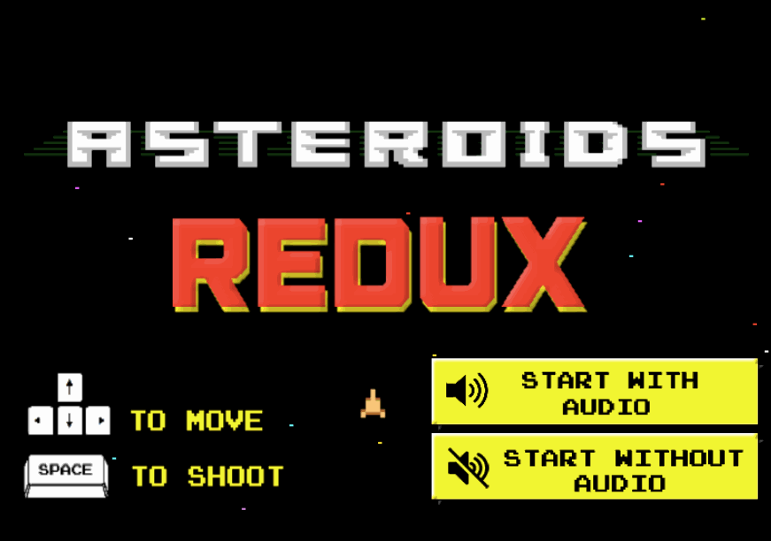

# Asteroids Redux
###### A rejuvenation of the classic arcade game, made entirely in vanilla JS and HTML5 Canvas.

### LIVE AT: http://haseeb-qureshi.github.io/Asteroids/

**Note: HTML5 Canvas rendering has major performance issues on many versions of Firefox. Please use IE or Chrome to ensure stable performance.**

## Features
* Dynamic difficulty
* Sound effects
* Powerups (triple laser, total destruction, and 1-up)
* Points and ranking system
* Custom-made particle effects
* Background track from Ikaruga!

## Implementation
* Extremely OO design, all objects strongly encapsulated
* Implements prototypical inheritance through surrogates (so all moving objects inherit common behavior from MovingObject class)
* Title screen stars are dynamically generated and drawn using O(n) algorithm
* Implements O(n) collision detection, measuring the radius of each collideable object with player's ship
* Particle effects generated dynamically using opacity and size throttling
* Garbage collects unused sprites and particles based on positioning and age
* Uses trigonometric functions to calculate movement physics, rotation, and ship geometry

# Todo
* Retry on space
* Tank controls?
* Invincible on spawn
